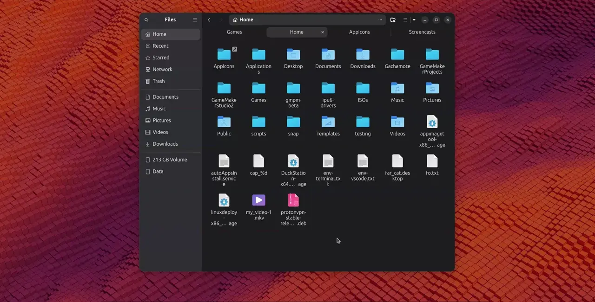

# AppImageDragDrop

This repository contains a script to simplify the process of handling AppImage files with drag-and-drop functionality. Inspired by macOS where the user can drag and drop an app into the Applications folder
  

The script will create a folder called Applications in the home users directory. Simply drag and drop an AppImage into that Applications folder, which will create a desktop entry.

Script creates and uses a script made systemd service, to you only need to manually run the script once.
# Demo



## Features

- Drag and drop AppImage files into Applications folder for easy management.
- Automates adding executing privileges to AppImages and creating .desktop entries.
- Includes a custom parameter `remove` to easily remove the service.

## Installation

1. Clone the repository
   Or download the zip file under the green code button:
    ```bash
    git clone https://github.com/yourusername/AppImageDragDrop.git
    cd AppImageDragDrop
    ```
2. Make the AppImage script executable:


    ```bash
    chmod +x AppImageDragDrop.sh
    ```

3. Run the script:
    ```bash
    ./AppImageDragDrop.sh
    ```
    Running it, it will move it self to ~/scripts/AppImageDragDrop
    This is done for a few reasons:

    📂 Centralized location – All scripts live in one predictable folder (~/scripts/AppImageDragDrop), making them easier to find and manage.

    🔄 Consistency – Instead of scattering files across different directories, everything is grouped together, reducing confusion.

    🧹 Easy clean up

## Removal
1. Run the script with the "remove" option to remove the service - Applications folder will be kept:
    ```bash
    ./AppImageDragDrop.sh remove
    ```


## Script Overview

- **`AppImageDragDrop.sh`**: Handles AppImage files with drag-and-drop functionality. Use the `remove` parameter to delete the created systemd service.

## Requirements

- Bash shell
- inotify-tools (script will install)


## License

This project is licensed under the [GPLv2 License](LICENSE).
